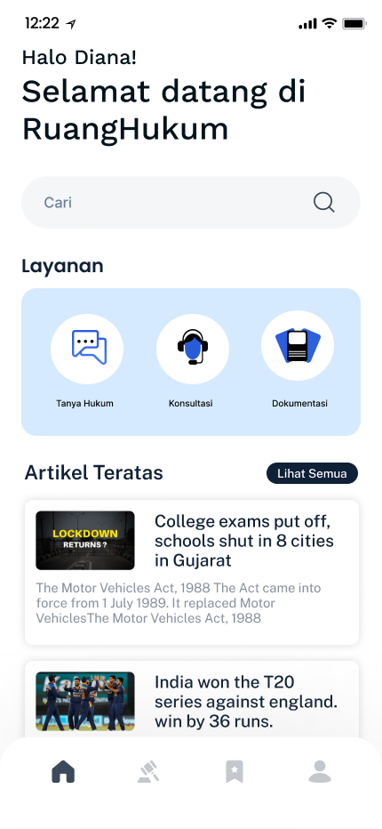

# Bebasss - RuangHukum

## Overview

Hi this is RuangHukum, where we are committed to ensuring that access to justice is a fundamental right for everyone. Our passionate team is dedicated to making legal services more accessible and affordable. Through our platform, we empower individuals to find the right lawyer for their specific needs, offering AI-based consultations, legal advice at a fair price, and a collection of legal document templates.
  

## Team Members

Meet the incredible minds behind RuangHukum:

Hacker: R. Dendi Anugerah Candra Diningrat
Hipster: Niki Hidayati
Hustler: Rahul Rahmatullah

## Table of Contents

- [Bebasss - RuangHukum](#bebasss---ruanghukum)
  - [Overview](#overview)
  - [Team Members](#team-members)
  - [Table of Contents](#table-of-contents)
  - [Features](#features)
  - [Installation](#installation)

## Features

List the key features of your pitch deck application. Consider using bullet points for better readability.

- AI Based consultation: Access legal advice through cutting-edge AI technology, providing personalized and efficient consultations, and of course the solution is based on the Indonesian legal landscape.
  
- Legal Document Templates: Choose from a variety of professionally crafted legal document templates designed to meet the specific needs of the Indonesian legal system.
- Lawyer Directory: Find the perfect lawyer for your needs with our comprehensive lawyer directory, tailored to the legal expertise.

## Installation

Provide instructions on how to install and set up your application. Include any dependencies that need to be installed and steps to configure the environment.

```bash
# Example installation command
npm install pitch-deck-app
```
