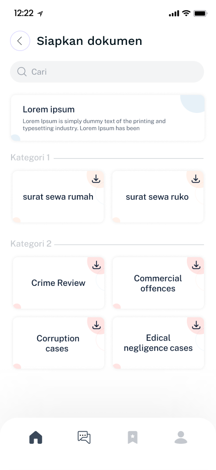

# Bebasss - RuangHukum

## Overview

<div align="center">
  <p>Hi, this is RuangHukum, where we are committed to ensuring that access to justice is a fundamental right for everyone. Our passionate team is dedicated to making legal services more accessible and affordable. Through our platform, we empower individuals to find the right lawyer for their specific needs, offering AI-based consultations, legal advice at a fair price, and a collection of legal document templates.</p>
  
</div>

## Team Members

Meet the incredible minds behind RuangHukum:

- **Hipster:** Niki Hidayati
- **Hustler:** Rahul Rahmatullah
- **Hacker:** R. Dendi Anugerah Candra Diningrat

## Table of Contents

- [Bebasss - RuangHukum](#bebasss---ruanghukum)
  - [Overview](#overview)
  - [Team Members](#team-members)
  - [Table of Contents](#table-of-contents)
  - [Mobile - Main Features](#mobile---main-features)
  - [Web Version](#web-version)
  - [How to use RuangHukum](#how-to-use-ruanghukum)

## Mobile - Main Features

We are proud to present the following features:

- **AI Based consultation**: Access legal advice through cutting-edge AI technology, providing personalized and efficient consultations, and of course the solution is based on the Indonesian legal landscape.
<div align="center">
    
</div>
- **Legal Document Templates**: Choose from a variety of professionally crafted legal document templates designed to meet the specific needs of the Indonesian legal system.
<div align="center">
    
    
</div>
- **Lawyer Directory**: Find the perfect lawyer for your needs with our comprehensive lawyer directory, tailored to the legal expertise.
<div align="center">
    
    
</div>

## Web Version

Right now, our website serves as a marketing platform to promote our main mobile application.

Additionally, we've introduced a web version of RuangHukum, accessible at [ruanghukum](https://ruanghukum-api.vercel.app/). Please note that the web version is currently in development, offering a limited set of features, primarily focused on marketing efforts.

<div align="center">
    
</div>

## How to use RuangHukum

1. Clone this repository
2. Open the project in Android Studio
3. Run the project
4. Enjoy the app!

```bash
git clone
```
